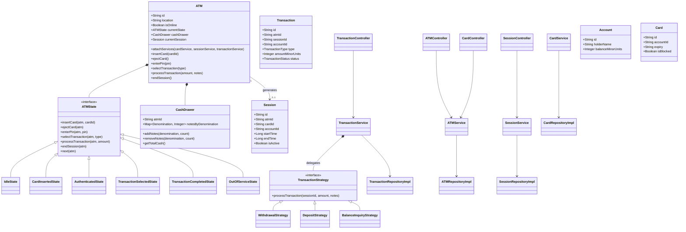

# ATM System Design (Low-Level Design)

An object-oriented ATM machine simulation implemented in Python. The system handles standard ATM operations robustly by utilizing design patterns such as the **State Pattern** corresponding to the physical runtime operations of the hardware, and the **Strategy Pattern** to execute disparate transaction types cleanly.

## Key Features
- **Session Management:** Tracks session limits, timeouts, active transactions, and card presence.
- **Card Reading/Authentication:** Validates card states computationally before executing ATM features.
- **Dynamic Cash Dispensing:** Audit logs and tracking for multiple denominations using an internal CashDrawer structure.
- **Role-based Authentication:** Admin users and Standard users have separated operational flows (e.g. Audit, Refill vs Transact, Balance Enquiry).
- **Strong Typing:** The entire application utilizes Python's robust `typing` module to ensure predictable data pipelines across operations (`Dict`, `Optional`, Custom Classes type hinting).

## Architecture & Patterns
1. **State Pattern:** Governs the finite state machine driving behavior of the ATM. This actively prevents illegal actions (e.g., trying to withdraw cash without authenticating). 
   - States: `IdleState`, `CardInsertedState`, `AuthenticatedState`, `TransactionSelectedState`, `TransactionCompletedState`, `OutOfServiceState`.
2. **Strategy Pattern:** Orchestrates dynamic transaction processing decoupling the core `ATM` models from underlying operations.
   - Triggers: `WithdrawalStrategy`, `DepositStrategy`, `BalanceInquiryStrategy`.
3. **Repository Pattern:** Bridges domain models and persistent storage systems without entangling business logic. All interactions pass through in-memory dictionary-backed DAOs.
4. **Service-Controller Pattern:** Distributes request handling logic, avoiding God classes.

## Getting Started

### Prerequisites
- Python 3.9+ 

### Installation & Execution
```bash
# Since the app uses standard python typings and tools, simply execute the entrypoint
python main.py
```

## UML Diagram

The diagram below maps the relationships across Controllers, Services, Strategies, States, Repositories, and the core Domain:


