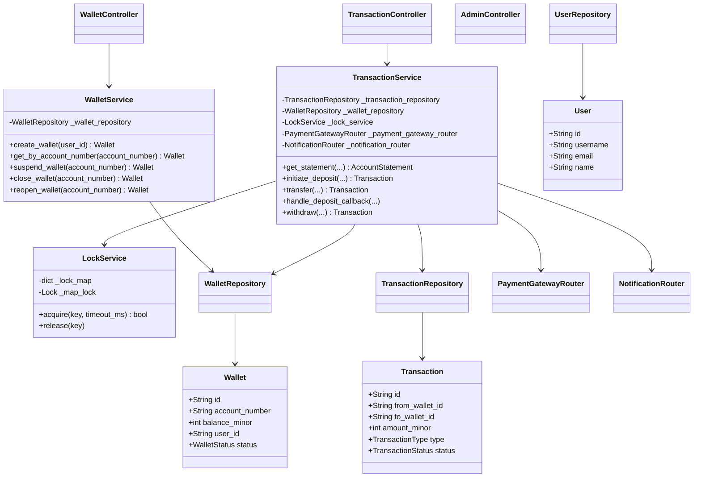

# Digital Wallet Design

A Python-based low-level design for a robust, scalable digital wallet system. This system allows users to create wallets, manage balances, deposit, withdraw, and transfer funds securely.

## System Architecture Overview

The system is built using a clean layered architecture, ensuring separation of concerns:
1. **Controllers**: Handle incoming requests and delegate to services.
2. **Services**: Contain the core business logic, orchestrating repositories, payment gateways, notifications, and concurrency control.
3. **Repositories**: Handle data persistence and retrieval for Domain entities.
4. **Domain**: Contains the core business entities (`User`, `Wallet`, `Transaction`, etc.) and value objects.
5. **Gateway & Notifications**: Interfaces to external providers.

### Core Features
*   **Wallet Management**: Create, suspend, close, and reopen wallets.
*   **Transactions**: Supports Deposits, Withdrawals, and Peer-to-Peer Transfers.
*   **Concurrency Control**: Ensures atomicity and consistency of wallet balances during concurrent transactions using per-wallet locking mechanisms.
*   **External Integrations**: Pluggable architecture for Payment Gateways and Notification services.

## UML Class Diagram

The following diagram illustrates the relationships between the core classes of the system:

## Running the Project

1. Ensure Python 3.8+ is installed.
2. The project acts as a library/core system for integration. Entry points are via the `controller` package or `main.py`.
3. Concurrency is handled internally via threading for single-node setups. For distributed environments, `LockService` should be updated to use Redis.
