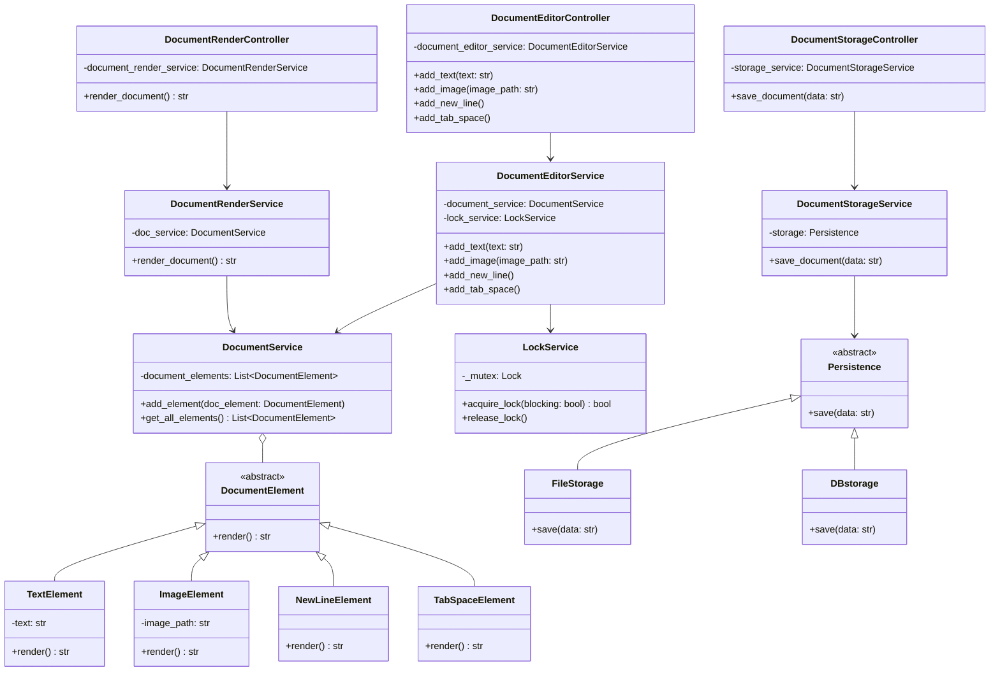

# Document Editor LLD (Low-Level Design)

A robust, modular Document Editor built in Python following a highly decoupled architecture. The system strictly adheres to the Controller-Service-Domain pattern, making the application highly maintainable, testable, and scalable. 

It handles multiple concurrent requests safely by enforcing mutual exclusion on operations with an implicit thread-locking mechanism.

## System Architecture

The project leverages a domain-driven architectural style, broken down into the following layers:

1. **Controllers**: Act as the entry points (e.g., API routes). They map client requests to internal service methods.
2. **Services**: Contains the core business logic. They process actions, manage state boundaries, and enforce thread-safety.
3. **Domain Layer**: Houses the core entities (`Document`, `DocumentElement`, `Persistence` interfaces). It knows nothing about the outer logic.
4. **Repositories/Infrastructure**: Concrete implementations of interfaces (e.g., `FileStorage`) to manage external side effects.

### Concurrency and Locking
A dedicated `LockService` guarantees that element insertion endpoints (`add_text`, `add_image`, etc.) are atomic. When a client performs an edit through the Controller, the Service implicitly acquires a `threading.Lock()` before interacting with the Domain entities, effectively eliminating race conditions when multiple users attempt to edit the document concurrently.

---

## UML Class Diagram

Below is the Mermaid UML representation of the complete architecture.



---

## Functional Flow Implementation

### 1. Document Editing
- The `DocumentEditorController` receives operations (like adding text, images, or formatting).
- It passes them to the `DocumentEditorService`.
- Inside the service layer, `LockService.acquire_lock()` is triggered.
- If the lock is successfully acquired, a new `DocumentElement` subclass is instantiated and passed to the `DocumentService`.
- Once the operation succeeds or fails, the lock is automatically released using a `finally` block to prevent deadlock scenarios.

### 2. Document Rendering
- The `DocumentRenderController` calls the `DocumentRenderService`.
- The service retrieves all elements inside the `DocumentService`.
- It dynamically iterates through them, calling the abstract `render()` function on each element.
- The polymorphic behavior resolves the specific element strings and concatenates them, returning the final output.

### 3. Document Saving
- The `DocumentStorageController` takes a rendered payload.
- It passes the data down to the `DocumentStorageService`.
- The service forwards it to the `Persistence` abstraction.
- The initialized implementation (`FileStorage`) processes the output and writes it to disk (`document.txt`).

## Execution

The system uses Dependency Injection. Run `main.py` to see the application initialize instances of its layers, inject dependencies, and simulate concurrent API operations on the document without crashing or overwriting the execution state.

```bash
python main.py
```
