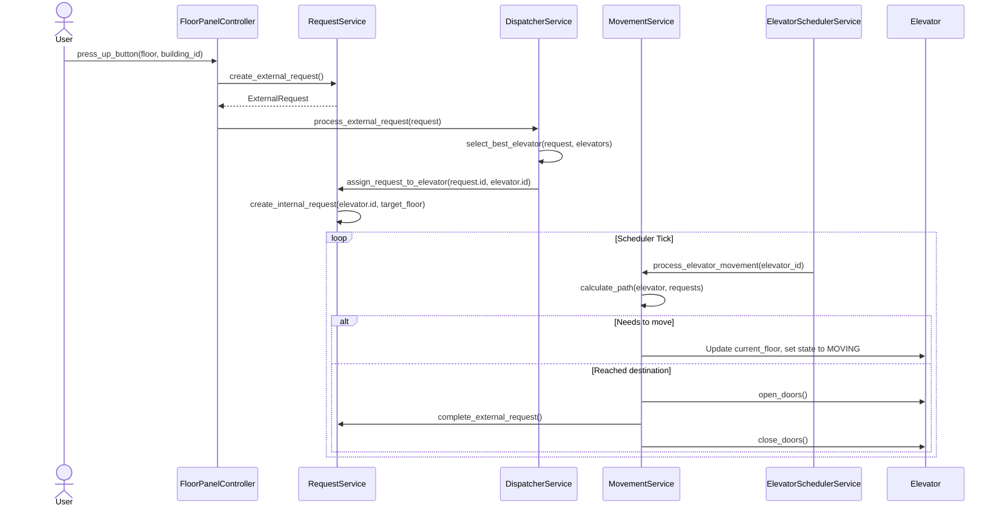
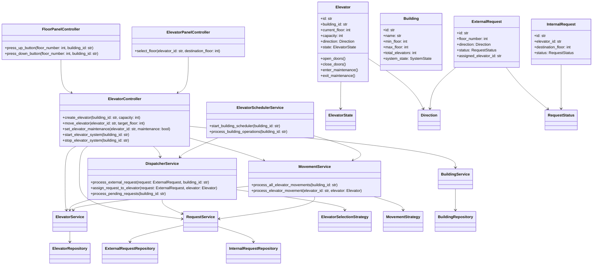

# Elevator System Design

This project is a low-level design (LLD) implementation of an Elevator System in Python. It models the core behaviors, components, and strategies required to simulate a scalable multi-elevator system in a building.

## Architecture Flow

The architecture follows a modular, controller-service-repository pattern, segregating responsibilities for better maintainability and scalability.

1. **Controllers (Presentation/Input Layer):**
   - **FloorPanelController:** Handles external requests (users pressing UP/DOWN buttons on a floor).
   - **ElevatorPanelController:** Handles internal requests (users selecting a destination floor inside an elevator).
   - **ElevatorController:** Serves as the primary orchestrator, managing elevator lifecycle (creation, starting, stopping, maintenance).

2. **Services (Business Logic Layer):**
   - **DispatcherService:** Receives external requests and uses a strategy (`ElevatorSelectionStrategy`) to determine the most suitable elevator to dispatch.
   - **ElevatorSchedulerService:** The central engine (or tick runner). In a simulation, it periodically checks and processes queues and elevator movements.
   - **MovementService:** Controls the actual floor-by-floor movement of elevators. It utilizes a `MovementStrategy` (e.g., SCAN, FCFS) to decide the next floor.
   - **RequestService:** Manages the lifecycle of both internal and external requests, updating their states (`PENDING`, `ASSIGNED`, `COMPLETED`).
   - **ElevatorService / BuildingService:** Manages domain entities like `Elevator` and `Building`.

3. **Repositories (Data Access Layer):**
   - In-memory data stores mapping IDs to objects. They provide `save()`, `find_by_id()`, and related query methods for `Building`, `Elevator`, `InternalRequest`, and `ExternalRequest`.

4. **Domain (Core Entities & States):**
   - **Entities:** `Building`, `Elevator`, `InternalRequest`, `ExternalRequest`.
   - **State Pattern:** The elevator uses the State Design Pattern (`ElevatorState`, `ElevatorStateHandler`) to smoothly transition between states (`STOPPED`, `MOVING`, `DOORS_OPENING`, `MAINTENANCE`).
   - **Strategy Pattern:** Uses strategies for movement (`MovementStrategy`) and selection (`ElevatorSelectionStrategy`).

### Request Flow Lifecycle

1. **User requests an elevator:** The `FloorPanelController` creates an `ExternalRequest`.
2. **Dispatching:** The `DispatcherService` queues the request or immediately assigns it to the best available `Elevator` using the selection strategy.
3. **Movement Execution:** The `ElevatorSchedulerService` invokes `MovementService.process_elevator_movement`. The elevator travels towards the target floor.
4. **User boards:** The elevator arrives and opens doors, marking the external request as completed. The user then selects a floor via the `ElevatorPanelController`, creating an `InternalRequest`.
5. **Destination Routing:** The `MovementService` calculates the optimal path using its `MovementStrategy` (e.g., SCAN) to drop off passengers efficiently and securely.

### Sequence Diagram: Handling an External Request



## UML Class Diagram



## Running the Simulation

Execute the following command to run the predefined simulation ticks in `main.py`:

```bash
python main.py
```
