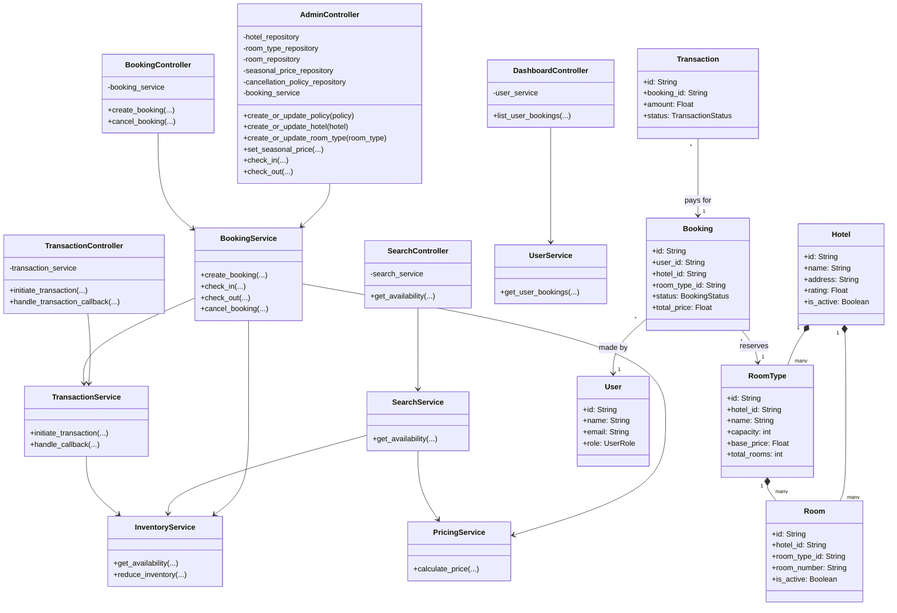

# Hotel Management System

A robust, low-level design (LLD) implementation of a Hotel Management System in Python. This project follows a structured, multi-layer architecture incorporating Controllers, Services, Repositories, and Domain Models to provide a clean separation of concerns and scalable business logic.

## Architecture & System Design

The system is designed with Domain-Driven Design (DDD) principles in a layered architecture:

- **Domain Layer**: Contains the core business entities (Models/Data Classes) such as `Hotel`, `Room`, `RoomType`, `User`, `Booking`, `Transaction`, and various policy models.
- **Repository Layer**: Handles data persistence. It abstracts database interactions using interfaces and implementations (e.g., `HotelRepositoryImpl`, `BookingRepositoryImpl`), allowing mock implementations or easy swapping of database providers without impacting other system layers.
- **Service Layer**: Contains the core business logic. It orchestrates interactions between repositories and external services (e.g., `BookingService`, `PricingService`, `InventoryService`, `SearchService`).
- **Controller Layer**: Exposes endpoints and orchestrates the flow of data between the user interfaces (or API routes) and the business services (e.g., `AdminController`, `SearchController`, `BookingController`).

## Key Features

- **Inventory Management**: Track and manage hotels, room types, and specific room availability. Handles overbooking policies and capacity management.
- **Dynamic Pricing**: Configure base prices and seasonal pricing overrides for specific dates and room types.
- **Search & Availability**: Search for available rooms across date ranges with built-in availability calculations.
- **Booking Lifecycle**: Seamlessly handle booking creation, confirmation via transactions, check-in, check-out, and transparent cancellation policies.
- **Transaction & Payment Handling**: Mock transaction integrations supporting pending, completed, and failed states to confirm reservations.
- **Roles & User Management**: Different access patterns like customer dashboard and admin management workflows.

## Class Diagram (UML)



## Running the Simulation

A main executable simulation file `main.py` is provided to demonstrate the complete workflow. It initializes the mock database records, creates instances for dependency injection, and runs through several key scenarios:

1. Establishing a cancellation policy and a new Hotel.
2. Generating room types and registering users.
3. Defining dynamic pricing for specific rooms based on seasonal dates.
4. Simulating a room availability search by customer.
5. Creating bookings and handling payment transactions.
6. Simulating admin workflows like user check-in and check-out.
7. Generating the user's booking dashboard.

### Execution

Simply execute the main file:

```bash
python main.py
```
