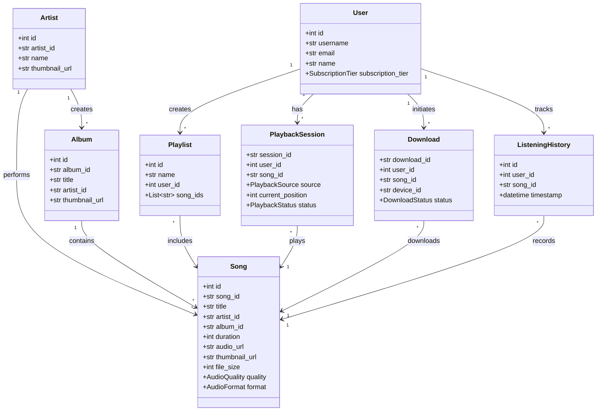
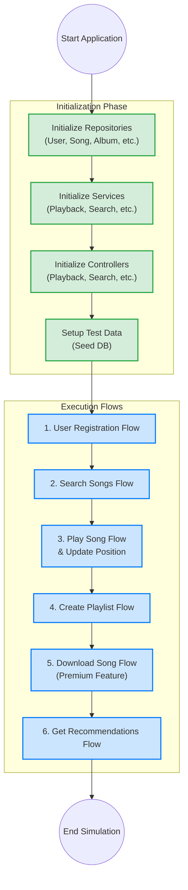

# Music Streaming App LLD

This repository contains the Low-Level Design (LLD) for a comprehensive Music Streaming Application implemented in Python. The system follows a layered architecture pattern, separating concerns across Controllers, Services, Repositories, and Domain Entities.

## Table of Contents

- [Architecture Overview](#architecture-overview)
- [UML Class Diagram](#uml-class-diagram)
- [Application Flow (Block Diagram)](#application-flow-block-diagram)
- [Domain Entities](#domain-entities)
- [System Components](#system-components)
  - [Controllers](#controllers)
  - [Services](#services)
  - [Repositories](#repositories)

## Architecture Overview

The application is structured using a standard layered architecture:

1. **Presentation/Controller Layer**: Receives input from the user (or API) and routes it to the appropriate service.
2. **Business/Service Layer**: Contains the core business logic, orchestrating actions across multiple domains and applying business rules.
3. **Data Access/Repository Layer**: Abstract interface for data storage, currently implemented using In-Memory Data Stores for simulation.
4. **Domain Layer**: Represents the core models and entities of the system (e.g., User, Song, Playlist).

## UML Class Diagram

The following Mermaid diagram represents the entities and relationships within the system:

## Application Flow (Block Diagram)

The following block diagram illustrates the initialization and execution flow defined in `main.py`.

## Domain Entities

- **User**: Core entity representing system users, including their `SubscriptionTier` (FREE/PREMIUM).
- **Artist**: Represents musical artists.
- **Album**: Represents a collection of songs.
- **Song**: Central entity representing an audio track, including its `AudioQuality` and `AudioFormat`.
- **Playlist**: A user-curated collection of songs.
- **PlaybackSession**: Maintains the state of a user's current playback.
- **Download**: Tracks the status of song downloads for offline listening.
- **ListeningHistory**: Logs when a user listens to a song for recommendation purposes.

## System Components

### Controllers
Act as entry points for the application flows:
- `PlaybackController`: Manages song playback, pausing, resuming, and position tracking.
- `SearchController`: Handles search queries for songs, artists, and albums.
- `PlaylistController`: Manages playlist creation, modification, and deletion.
- `DownloadController`: Handles offline download requests (checks premium status).
- `RecommendationController`: Interfaces with the recommendation engine to provide user suggestions.
- `StreamingController`: Handles the underlying streaming protocols.

### Services
Contain the core business logic:
- `PlaybackService`: Coordinates between streaming, history, and sessions.
- `SearchService`: Queries repositories to fulfill search requests.
- `PlaylistService`: Implements playlist management with `LockingService` for concurrency control.
- `DownloadService`: Handles the logic for caching and persisting downloads.
- `RecommendationService`: Applies a `GenreBasedStrategy` to suggest songs based on `ListeningHistory`.
- `StreamingService`: Interacts with the `CacheService` to deliver song streams efficiently.

### Repositories
Data access interfaces, currently utilizing In-Memory storage:
- `InMemoryUserRepository`
- `InMemorySongRepository`
- `InMemoryAlbumRepository`
- `InMemoryArtistRepository`
- `InMemoryPlaylistRepository`
- `InMemoryListeningHistoryRepository`
- `InMemoryPlaybackSessionRepository`
- `InMemoryDownloadRepository`
