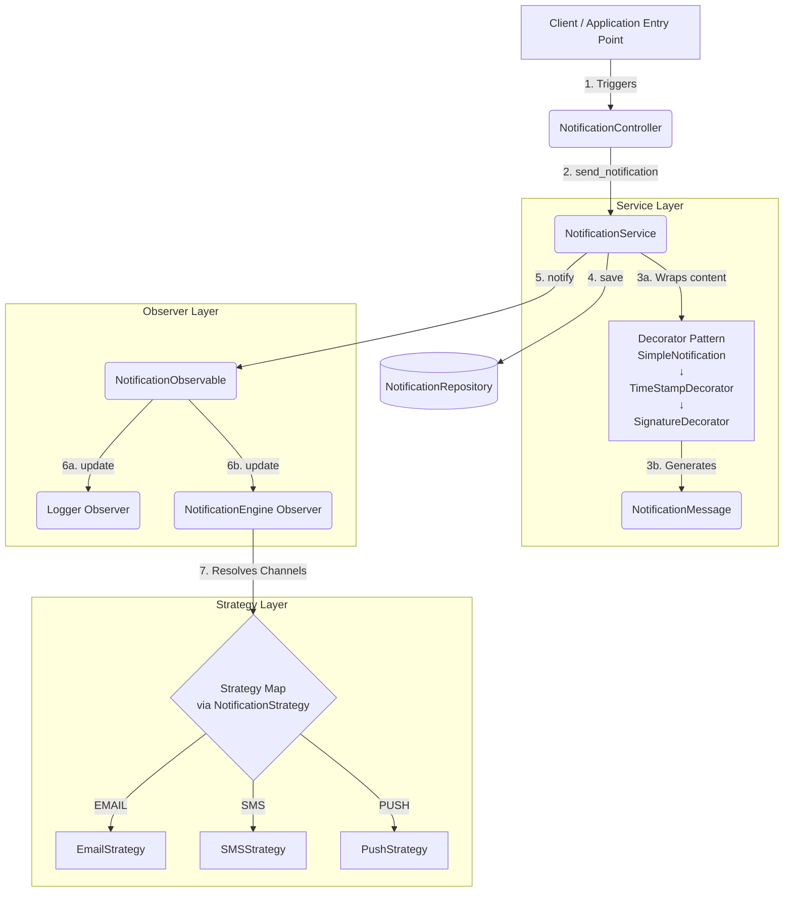
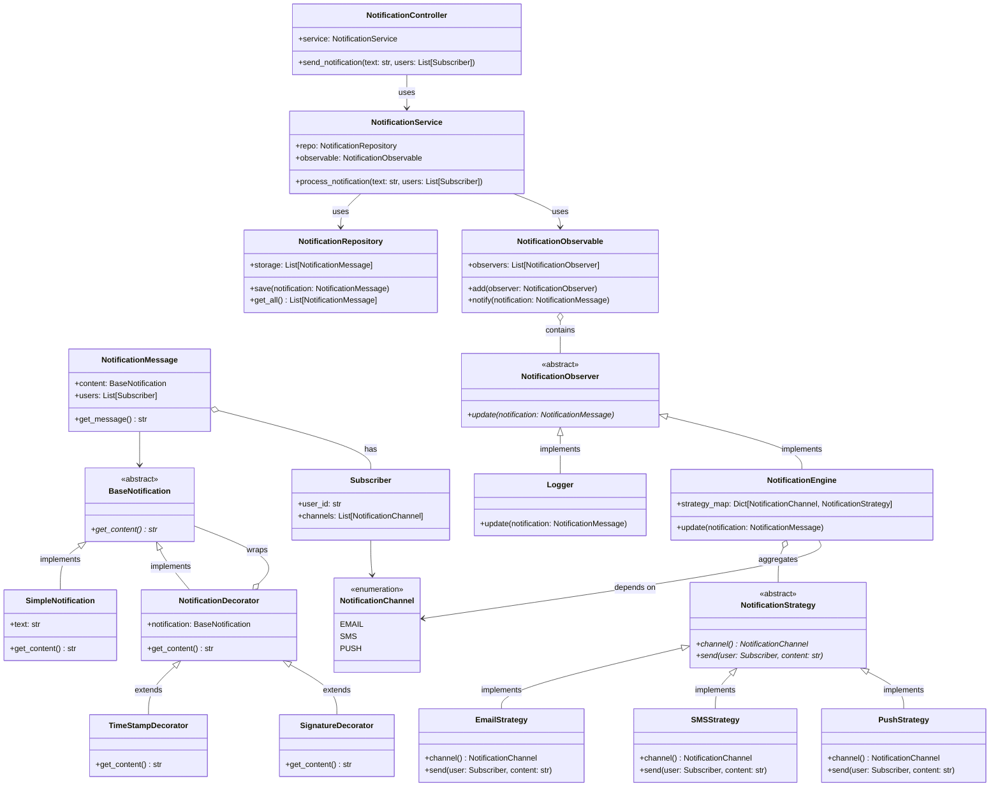

# Notification System - System Architecture & Design

This document provides a comprehensive overview of the Notification System, covering its layered architecture, entities, and the core design patterns used to ensure modularity, scalability, and adherence to the Open/Closed Principle.

## 1. Architectural Flow (Block Diagram)

The following block diagram represents the execution flow from the moment a notification is triggered by the client until it is dispatched to the users via their preferred channels.

### Flow Explanation:
1. **Triggering**: The client (or `main.py`) calls the `NotificationController` to send a notification to a list of users.
2. **Processing**: The controller delegates the task to the `NotificationService`.
3. **Decorating**: The service takes the raw text and dynamically adds features (Timestamp and Signature) using the **Decorator Pattern**. It then packages this content and the target users into a `NotificationMessage` domain entity.
4. **Persistence**: The service saves the generated message to the database via the `NotificationRepository`.
5. **Notification**: The service triggers the `NotificationObservable` (Publisher).
6. **Observation**: The `NotificationObservable` notifies all registered subscribers (**Observer Pattern**). In this system, the `Logger` records the event, and the `NotificationEngine` handles the delivery.
7. **Delivery**: The `NotificationEngine` looks at each user's preferred channels and utilizes the **Strategy Pattern** to select the correct delivery mechanism (Email, SMS, or Push) dynamically.

---

## 2. UML Class Diagram

This class diagram visualizes the object-oriented structure of the project, including relationships (Inheritance, Composition, and Aggregation) and the interfaces for the design patterns used.

## 3. Key Design Patterns Utilized

1. **Strategy Pattern**
   - **Where:** `service/strategy/`
   - **Why:** Allows adding new notification channels without altering existing delivery logic. The `NotificationEngine` dynamically resolves the correct strategy using the Enum as a key.
2. **Observer Pattern**
   - **Where:** `service/observer/`
   - **Why:** Separates the core notification persistence/generation from downstream effects. Adding a new behavior (like a metric tracker or an external webhook) simply requires creating a new `NotificationObserver` and adding it to the `NotificationObservable`.
3. **Decorator Pattern**
   - **Where:** `service/decorator/`
   - **Why:** Prevents "class explosion" when adding features to a message (e.g., trying to maintain `TimeStampSignatureNotification`, `TimeStampNotification`, etc.). It allows combining message augmentations recursively at runtime.
