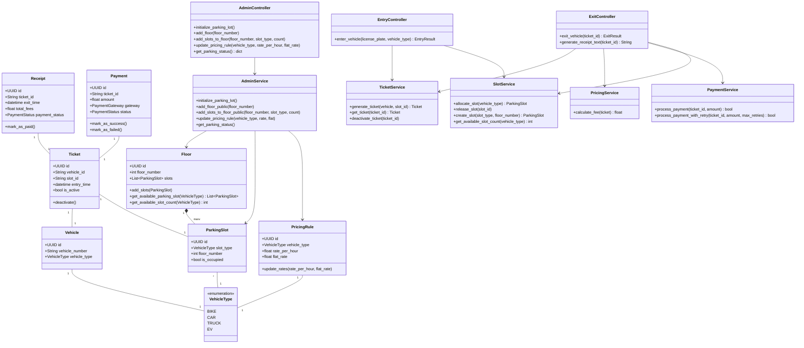

# Parking Lot Design Documentation

## 1. Introduction
This documentation provides a comprehensive overview of the Low-Level Design (LLD) for the modular Parking Lot System implemented in Python. The system follows Domain-Driven Design (DDD) principles and an underlying Clean Architecture (Controller &rarr; Service &rarr; Repository &rarr; Domain).

## 2. Architecture Overview
- **Domain**: Contains the core business entities (`Vehicle`, `Ticket`, `Receipt`, `Payment`, `ParkingSlot`, `Floor`, `PricingRule`).
- **Repository**: Handles data storage abstraction (currently utilizing in-memory structures for simulation) mapping to `FloorRepository`, `SlotRepository`, `TicketRepository`, etc.
- **Service**: Encapsulates specific business logic operations and coordinates operations between disparate domains and repositories (`AdminService`, `TicketService`, `PricingService`, `PaymentService`, etc.).
- **Adapter**: Provides standardized interfaces integrating external dependency endpoints like mock payment gateways (`RazorpayAdapter`, `StripeAdapter`).
- **Controller**: Acts as the simulation entry junction exposing methods for end-user and administrative requests (`AdminController`, `EntryController`, `ExitController`).

## 3. Flow & Architecture Diagrams (UML)

The following UML Class Diagram details all active classes, their attributes, core methods, and relationships mapping out how the modular subsystems tie together.

### 3.1 Domain & Service Layer Class Diagram

## 4. System Design Patterns Utilized
1.  **Repository Pattern**: Isolates data access operations. The abstraction ensures that if this system scales to employ a proper SQL or NoSQL database, the overall service layer won't require restructuring.
2.  **Strategy / Adapter Pattern**: Coordinates multiple mocked external payment gateways cleanly. The base abstract implementations allow expanding into additional processors with ease.
3.  **Dependency Injection**: Controllers consistently acquire instances of required `Services` explicitly via class constructors. Rather than locally instantiating dependencies, components expect the dependency context. Noticeable in `main()` injection wiring schemas.
4.  **MVC & Service-layer separation**: A strict separation isolating entry endpoints (controllers), operational business processes (services), and localized data stores (repositories).

## 5. Summary of Operations
- **System Bootstrapping**: Handled by the `AdminController` which establishes structural objects (Floors, respective multi-tiered Slots) alongside generic Pricing structures.
- **Entering the System**: Exclusively searches for correctly sized spatial allocations via resolving through the `SlotService`. The creation of a unified `Ticket` bridges a `Vehicle` with structural tracking endpoints and anchors exact entrance temporal markers.
- **Exiting workflows**: Heavily leverages `PricingService` heuristics (accounting for generic per-hour models intersecting flat rates alongside specific class limitations). Introduces an autonomous fallback mechanic resolving monetary actions iteratively in the `PaymentService` utilizing independent adapter systems prior to printing consolidated standard receipts.
