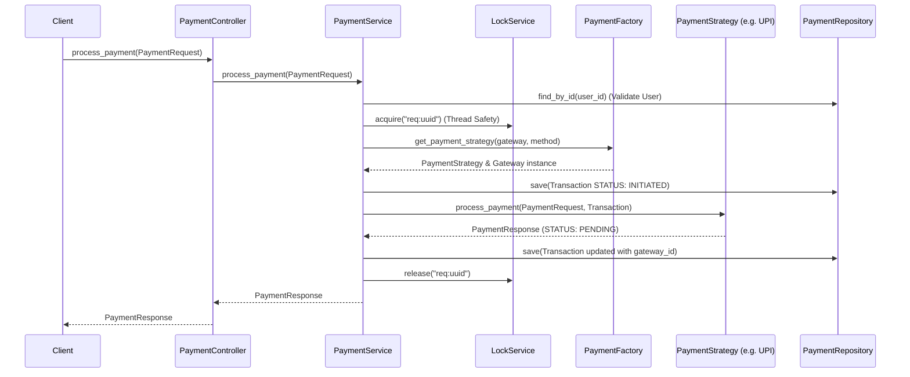
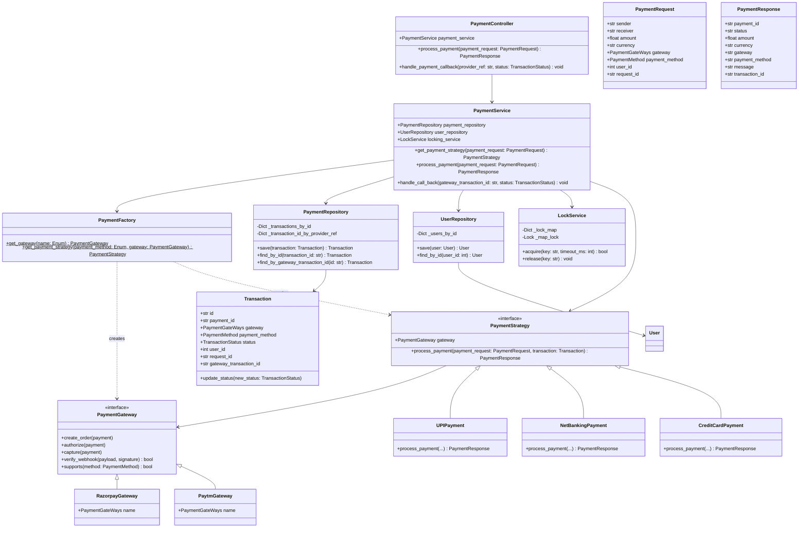

# Payment Gateway System - Low-Level Design (LLD)

A robust, highly modular Python-based Low-Level Design for a Payment Gateway System. The project simulates processing payments across multiple gateways (e.g., Razorpay, Paytm) and multiple payment methods (e.g., UPI, Credit Card, Net Banking) while handling concurrent requests gracefully.

---

## 🏗 System Architecture & Design Patterns

The architecture tightly follows **SOLID Principles** and uses a multi-layered design separating concerns between routing, business logic, integrations, and persistence.

### Layers
1. **Controller Layer (`payment_controller.py`)**: Acts as the entry point handling API/client requests and webhook callbacks.
2. **Service Layer (`payment_service.py`, `locking_service.py`)**: Houses the core business logic, controls transaction state, manages distributed locks to prevent race conditions, and coordinates with factories and strategies.
3. **Domain Layer (`domain/`)**: Contains pure dataclasses and Enums representing the business entities (`Transaction`, `PaymentRequest`, `PaymentResponse`, `User`, `TransactionStatus`).
4. **Repository Layer (`repository/`)**: In-memory storage components (`PaymentRepository`, `UserRepository`) mimicking a database to store and retrieve states.

### Design Patterns Utilized
- **Strategy Pattern (`PaymentStrategy`)**: Allows the system to dynamically execute different payment logic (UPI, NetBanking, Credit Card) without polluting the main service logic with `if/else` checks.
- **Factory Pattern (`PaymentFactory`)**: Encapsulates the instantiation logic for creating `PaymentGateway` and `PaymentStrategy` instances based on user requests.
- **Template Method / Interface (`PaymentGateway`)**: Defines a standardized contract (`create_order`, `authorize`, `capture`) that any external provider (Razorpay, Paytm) must adhere to, making the system extensible.

---

## 🔄 Execution Flow Diagram

The sequence diagram below visualizes the flow of a standard payment request, from the moment a client initiates it to the moment a response is returned.



---

## 📊 UML Class Diagram



---

## 🚀 Getting Started

### Prerequisites
- Python 3.8+

### Execution
Run the system using the provided entry point:

```bash
python3 main.py
```

### Example Output
When executing `main.py`, you will see a complete lifecycle simulation including User creation, Payment Initialization, and an incoming Webhook simulating success:

```
=== Initializing Payment Gateway System ===

--- Creating User ---
User created: John Doe (ID: 1)

--- Creating Payment Request (Request ID: 1234-abcd-5678-efgh) ---

--- Processing Payment ---
[UPI] Initiating payment for user 1
[UPI] Creating collect request
[UPI] Sending request to PSP
[UPI] Waiting for user approval (callback expected)
Payment Response:
  Payment ID: pay_1234-abcd-5678-efgh
  Status: PENDING
  Transaction ID: txn_1234-abcd-5678-efgh
  Message: UPI collect request sent

--- Simulating Webhook Callback from Payment Gateway ---
Received webhook for Gateway Transaction ID: upi_txn_9876-zyxw-4321-vuts
Transaction Status after callback: SUCCESS
```
