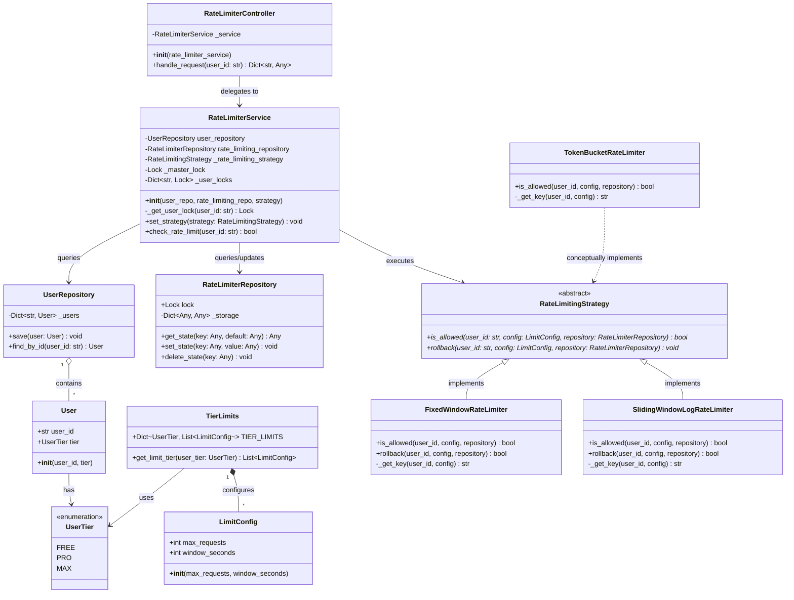

# Rate Limiter - Low-Level Design (LLD) in Python

This repository contains a thread-safe, scalable, and extensible Python implementation of an API Rate Limiter designed using SOLID principles and Gang of Four (GoF) design patterns. It supports multiple rate-limiting algorithms, multi-limit configurations per subscription tier (e.g., throttling requests per minute and per day simultaneously), and thread-safe execution under concurrent loads.

---

## 📖 Table of Contents
1. [System Overview](#-system-overview)
2. [Detailed Class Diagram](#-detailed-class-diagram)
3. [Rate Limiting Algorithms (Explained Simply)](#-rate-limiting_algorithms)
   - [1. Fixed Window Counter](#1-fixed-window-counter)
   - [2. Token Bucket](#2-token-bucket)
   - [3. Sliding Window Log](#3-sliding-window-log)
4. [Gang of Four (GoF) Design Patterns & Clean Architecture](#-gang-of-four-gof-design-patterns--clean-architecture)
5. [Concurrency & Thread Safety](#-concurrency--thread-safety)
6. [Subscription Tiers & Configurations](#-subscription-tiers--configurations)
7. [Running the Application](#-running-the-application)

---

## 🌐 System Overview

An API Rate Limiter is a critical system component used to control the rate of traffic sent by a client or user to an API. It protects downstream services from abuse, DDoS attacks, resource starvation, and brute-forcing, while also enabling monetized tier-based API access.

This design implements a clean separation of concerns across multiple layers:
1. **Controller Layer (`RateLimiterController`)**: Intercepts incoming client calls (simulating an API Gateway or Middleware) and returns appropriate HTTP status codes (`200 OK` or `429 Too Many Requests`).
2. **Service Layer (`RateLimiterService`)**: Resolves the user's tier, fetches the associated multi-window limit configuration, coordinates the execution of the active rate-limiting strategy, and handles thread synchronization per user.
3. **Strategy Layer (`RateLimitingStrategy` & Implementations)**: Encapsulates the algorithmic check for whether a request is allowed or blocked.
4. **Repository Layer (`UserRepository`, `RateLimiterRepository`)**: Abstracts state storage and data access. The `RateLimiterRepository` serves as an in-memory key-value store for storing algorithm counters and logs.

---

## 📊 Detailed Class Diagram

Below is the detailed class diagram visualizing the components, properties, methods, and relationships. It uses standard UML notation represented via Mermaid.



---

## ⚡ Rate Limiting Algorithms (Explained Simply)

This system implements three popular rate-limiting algorithms, each representing different tradeoffs in memory, accuracy, and performance.

---

### 1. Fixed Window Counter
* **File location:** [fixed_window.py](file:///Users/sarthakshukla/Desktop/LLD%20PYTHON/RATE%20LIMITER/domain/strategies/fixed_window.py)

#### 💡 The Analogy: The Ticket Booth Reset
Imagine a ticket booth that gives out a maximum of 10 free ride tickets per hour. At the start of every hour (e.g., 1:00 PM, 2:00 PM), the ticket collector throws away the record sheet and starts counting from 0 again. 

#### ⚙️ How it Works
1. Time is divided into fixed, static windows (e.g., 60-second intervals starting from Unix Epoch).
2. The current window block is computed using the formula:
   $$\text{window\_bucket} = \lfloor \frac{\text{current\_time}}{\text{window\_seconds}} \rfloor$$
3. Each user gets a unique storage key for each window: `rate_limit:{user_id}:{window_seconds}:{window_bucket}`.
4. When a request arrives, the system fetches the count for this key. If the count is below the maximum allowed, the counter is incremented, and the request is permitted. Otherwise, the request is blocked.

#### ⚖️ Tradeoffs
* **Pros**: Very fast and consumes extremely little memory (just a single integer counter per window).
* **Cons**: **The Boundary Burst Problem**. A user could exploit the reset boundary. For instance, if the limit is 10 requests per minute, a user can send 10 requests at `11:59:59` (end of window 1) and another 10 requests at `12:00:00` (start of window 2). The rate limiter allows all 20 requests, even though they were sent within a 1-second interval, violating the intent of the throttle.

---

### 2. Token Bucket
* **File location:** [token_bucket.py](file:///Users/sarthakshukla/Desktop/LLD%20PYTHON/RATE%20LIMITER/domain/strategies/token_bucket.py)

#### 💡 The Analogy: The Refilling Coffee Pot
Imagine a coffee pot in an office that can hold up to 10 cups of coffee. Every 6 minutes, a fresh cup of coffee automatically drips into the pot. If the pot is full (10 cups), any extra drips overflow and are lost. When an employee wants coffee, they pour a cup. If the pot is empty, they must wait until a new cup drips in. If someone wants to host a quick meeting, they can immediately pour 10 cups all at once (burst capability), but they can't pour any more until it refills.

#### ⚙️ How it Works
1. We associate a bucket with each user having a maximum capacity ($C$) and a fill rate ($r$ tokens per second).
2. Instead of running a background thread to add tokens (which is computationally expensive), the system refills tokens **lazily** whenever a new request arrives.
3. Upon receiving a request at time $t_{current}$, the system calculates the time elapsed since the last request:
   $$\text{elapsed} = t_{current} - t_{last\_refill}$$
4. The tokens are replenished proportionally:
   $$\text{refilled\_tokens} = \text{elapsed} \times \text{refill\_rate}$$
   $$\text{new\_tokens} = \min(C, \text{current\_tokens} + \text{refilled\_tokens})$$
5. If $\text{new\_tokens} \ge 1.0$, the request is allowed, we decrement by $1.0$, and update the state to $(\text{new\_tokens} - 1.0, t_{current})$. Otherwise, we reject the request.

#### ⚖️ Tradeoffs
* **Pros**: Excellent for handling bursty traffic (allows sudden spikes of up to capacity $C$). Very memory-efficient because it only stores two floats: the current token count and the last refill timestamp.
* **Cons**: Can result in downstream database or service overload during a burst, as a large number of requests can hit simultaneously if the bucket is full.

---

### 3. Sliding Window Log
* **File location:** [sliding_window_log.py](file:///Users/sarthakshukla/Desktop/LLD%20PYTHON/RATE%20LIMITER/domain/strategies/sliding_window_log.py)

#### 💡 The Analogy: The Security Guard's Logbook
Imagine a security guard guarding a museum who must enforce that no more than 10 visitors enter within any rolling 60-minute interval. Instead of resetting a counter at the top of the hour, the guard writes down the exact timestamp of every single visitor entering in a logbook. When a new visitor arrives, the guard looks at their watch, deletes all entries in the logbook older than exactly 60 minutes ago, counts the remaining lines, and decides whether to let the new visitor in.

#### ⚙️ How it Works
1. The repository stores a list of timestamps for each user: `[t1, t2, t3, ...]`.
2. When a request arrives at $t_{current}$, the system defines the window threshold:
   $$\text{window\_start} = t_{current} - \text{window\_seconds}$$
3. **Eviction Phase**: The system filters the list, removing any timestamps that are older than $\text{window\_start}$.
4. **Admission Phase**: It checks the length of the filtered list. If $\text{length} < \text{max\_requests}$, the current timestamp $t_{current}$ is appended to the list, the updated list is saved, and the request is allowed. If $\text{length} \ge \text{max\_requests}$, the request is rejected (but the evicted list is still saved to free up memory).

#### ⚖️ Tradeoffs
* **Pros**: Extremely accurate. It eliminates the boundary burst problem because the window slides continuously.
* **Cons**: High memory consumption. Since it stores timestamps for every single successful request, memory usage grows proportionally to the traffic volume. Filtering the list also requires more CPU cycles as traffic scale increases.

---

## 🏗️ Gang of Four (GoF) Design Patterns & Clean Architecture

The project applies several structural, behavioral, and creational software patterns to ensure high modularity, readability, and testability.

### 1. Strategy Pattern (Behavioral)
* **Components:** [RateLimitingStrategy](file:///Users/sarthakshukla/Desktop/LLD%20PYTHON/RATE%20LIMITER/domain/strategies/base_rate_limit_strategy.py) (Abstract Base Class), [FixedWindowRateLimiter](file:///Users/sarthakshukla/Desktop/LLD%20PYTHON/RATE%20LIMITER/domain/strategies/fixed_window.py), [SlidingWindowLogRateLimiter](file:///Users/sarthakshukla/Desktop/LLD%20PYTHON/RATE%20LIMITER/domain/strategies/sliding_window_log.py), and [TokenBucketRateLimiter](file:///Users/sarthakshukla/Desktop/LLD%20PYTHON/RATE%20LIMITER/domain/strategies/token_bucket.py).
* **Intent:** Define a family of algorithms, encapsulate each one, and make them interchangeable.
* **LLD Details:** The `RateLimiterService` executes the check using an interface reference (`RateLimitingStrategy`). It does not need to know the algorithmic details of how requests are verified. The strategy can be switched dynamically at runtime using `set_strategy(new_strategy)` without modifying the service class.

### 2. Facade Pattern (Structural)
* **Components:** [RateLimiterController](file:///Users/sarthakshukla/Desktop/LLD%20PYTHON/RATE%20LIMITER/controller/rate_limiting_controller.py)
* **Intent:** Provide a unified interface to a set of interfaces in a subsystem. Facade defines a higher-level interface that makes the subsystem easier to use.
* **LLD Details:** Clients (such as Web Frameworks, Routers, or API Gateways) interact only with the `RateLimiterController.handle_request()` method. They are shielded from the complexities of fetching users, determining tiers, retrieving limit configurations, acquiring locks, and executing strategies.

### 3. Repository Pattern (Data Access abstraction)
* **Components:** [UserRepository](file:///Users/sarthakshukla/Desktop/LLD%20PYTHON/RATE%20LIMITER/repository/user_repository.py), [RateLimiterRepository](file:///Users/sarthakshukla/Desktop/LLD%20PYTHON/RATE%20LIMITER/repository/rate_limiter_repository.py)
* **Intent:** Mediate between domain and data mapping layers using a collection-like interface for accessing domain objects.
* **LLD Details:** The repository isolates the business logic from persistence concerns. If the state store is migrated from an in-memory dictionary to Redis or a SQL database in the future, only the Repository classes need to be updated. The Core Service and Strategy layers remain completely untouched.

### 4. Dependency Injection / Dependency Inversion (SOLID Principle)
* **Components:** [main.py](file:///Users/sarthakshukla/Desktop/LLD%20PYTHON/RATE%20LIMITER/main.py) (Assembly Pipeline)
* **Intent:** High-level modules should not depend on low-level modules; both should depend on abstractions.
* **LLD Details:** Instead of the `RateLimiterService` hardcoding the creation of `UserRepository` or a specific strategy, they are passed (injected) via its constructor:
  ```python
  rate_limiter_service = RateLimiterService(
      user_repo=user_repository, 
      rate_limiting_repo=rate_limiter_repository, 
      strategy=default_strategy
  )
  ```
  This makes the service highly testable, as we can inject mock repositories and mock strategies in unit tests.

---

## 🧵 Concurrency & Thread Safety

To operate correctly in a high-concurrency API Gateway or production backend, rate limit state checks and updates must be atomic. The implementation handles concurrency using **two levels of locking**:

1. **Repository-Level Lock (`repository.lock`)**:
   * Concrete strategies acquire the repository's mutual exclusion lock (`with repository.lock:`) when reading and writing states (e.g., getting and incrementing counters or logs). This prevents race conditions where two threads read the same counter value simultaneously and write back an invalid count.
2. **Service-Level Per-User Lock (`_get_user_lock`)**:
   * In [RateLimiterService](file:///Users/sarthakshukla/Desktop/LLD%20PYTHON/RATE%20LIMITER/service/rate_limiting_service.py), a master lock protects a dictionary of individual user locks (`self._user_locks`).
   * When evaluating multi-limit configurations for a user, the system locks on that specific user ID.
   * **Why this is efficient:** Locking per user allows concurrent requests from different users to be evaluated in parallel without blocking each other. Only concurrent requests from the *same* user are serialized, protecting user rate limit transactions.

---

## 💎 Subscription Tiers & Configurations
* **File location:** [tier_config.py]

The rate limiter supports cascading rules (e.g., limit a user to both $X$ requests per minute and $Y$ requests per day). If any configuration window block is violated, the entire check fails.

Configurations are defined as follows:

| User Tier | Minute Limit | Daily Limit |
| :--- | :--- | :--- |
| **FREE** | 10 requests / 60 seconds | 100 requests / 86400 seconds |
| **PRO** | 50 requests / 60 seconds | 500 requests / 86400 seconds |
| **MAX** | 100 requests / 60 seconds | 1000 requests / 86400 seconds |

---

## 🚀 Running the Application

A multi-threaded simulation pipeline is provided in `main.py` to demonstrate the rate limiter in action. It spins up 13 concurrent client threads representing a single **FREE** user trying to send requests simultaneously. 

### Step-by-Step execution

1. Run the simulation script:
   ```bash
   python3 main.py
   ```

### Expected Output
The first 10 requests will be successfully authorized, while the final 3 requests will be rejected with an HTTP `429` status code as the minute limit of 10 requests is reached:

```text
--- Executing 13 Concurrent Threads on FREE User (Max Allowed: 10/min) ---
[Thread-12345] Call #1: Status 200 -> Request Authorized.
[Thread-12346] Call #2: Status 200 -> Request Authorized.
...
[Thread-12354] Call #10: Status 200 -> Request Authorized.
[Thread-12355] Call #11: Status 429 -> Too Many Requests. Limit Exceeded.
[Thread-12356] Call #12: Status 429 -> Too Many Requests. Limit Exceeded.
[Thread-12357] Call #13: Status 429 -> Too Many Requests. Limit Exceeded.

State validation complete. Exactly 10 requests were authorized and transactions were rolled back accurately.
```
