# Ride Booking Service - Low Level Design

This project implements a complete backend Low-Level Design (LLD) for a Ride Booking Service (similar to Uber or Lyft). It embraces Domain-Driven Design (DDD) principles and features a loosely coupled architecture with well-defined layers: Domain, Service, Repository, and Controller.

## 🏗️ Architectural Layers

The system is built using a clean, layered architecture to ensure separation of concerns, testability, and scalability.

1.  **Domain Layer (`domain/`)**:
    *   Contains the core business entities, enums, data structures, and state definitions.
    *   **Components**: `Ride`, `Rider`, `Driver`, `Location`, `RideRequest`.
    *   **Enums**: `RideStatus`, `DriverStatus`, `PaymentStatus`, `PaymentType`.
    *   **Strategy**: Implementations for Pricing (e.g., `BasePricingStrategy`) and Matching (e.g., `NearestDriverStrategy`).
    *   **State Machine**: `RideStateMachine` ensures valid transitions between ride states.

2.  **Repository Layer (`repository/`)**:
    *   Abstracts data persistence. Provides interfaces for CRUD operations on entities.
    *   **Components**: `RideRepository`, `DriverRepository`, `RiderRepository`, `LocationRepository`.
    *   **Implementation (`repository/implementation/`)**: Provides thread-safe, in-memory implementations for these repositories (e.g., `InMemoryRideRepository`).

3.  **Service Layer (`service/`)**:
    *   Contains the core business logic, orchestrating interactions between entities and repositories.
    *   **Components**:
        *   `RideService`: The central hub for ride operations (requesting, accepting, starting, completing).
        *   `MatchingService`: Uses matching strategies to find and assign drivers to riders.
        *   `PaymentService`: Handles mock payment processing and callbacks.
        *   `PricingService`: Calculates estimated fares based on distance and duration.
        *   `LocationService`: Manages location updates and calculates distances.
        *   `LockService`: Provides distributed/local locking to prevent race conditions during concurrent ride operations.
        *   `NotificationService`: Handles sending messages to riders and drivers.

4.  **Controller Layer (`controller/`)**:
    *   The entry point for client requests. Maps incoming requests to the appropriate service methods.
    *   **Components**: `RideController`, `DriverController`, `PaymentController`.

---

## 📊 UML Class Diagram

The following class diagram provides a comprehensive view of the entire system, detailing all classes, interfaces, attributes, and methods.

```mermaid
classDiagram
    %% Entities
    class Rider {
        +String id
        +String name
        +String email
        +String phone
        +int created_at
    }
    
    class Driver {
        +String id
        +String name
        +String email
        +String phone
        +String vehicle_number
        +String vehicle_type
        +DriverStatus status
        +Location current_location
        +int last_location_update
    }

    class Ride {
        +String id
        +String rider_id
        +String driver_id
        +Location pickup_location
        +Location dropoff_location
        +RideStatus status
        +PaymentType payment_type
        +PaymentStatus payment_status
        +String payment_id
        +int estimated_fare
        +float estimated_distance_km
        +float actual_distance_km
        +int estimated_duration_sec
        +int actual_duration_sec
        +int requested_at
        +int assigned_at
        +int accepted_at
        +int started_at
        +int completed_at
        +int cancelled_at
        +String cancellation_reason
    }

    class Location {
        +float latitude
        +float longitude
        +String address
        +int timestamp
    }

    %% Data Transfer Objects / Requests / Responses
    class RideRequest {
        +String rider_id
        +Location pickup_location
        +Location dropoff_location
        +PaymentType payment_type
    }

    class FareEstimateResponse {
        +int estimated_fare
        +float estimated_distance_km
        +int estimated_duration_sec
    }

    class RideStatusResponse {
        +String ride_id
        +RideStatus status
        +String driver_id
        +String driver_name
        +Location driver_location
        +int estimated_fare
        +int timestamp
    }
    
    class NotificationMessage {
        +String user_id
        +String title
        +String body
    }

    %% Enums
    class DriverStatus {
        <<enumeration>>
        ONLINE
        OFFLINE
        ON_RIDE
    }
    
    class RideStatus {
        <<enumeration>>
        REQUESTED
        ASSIGNED
        ACCEPTED
        IN_PROGRESS
        COMPLETED
        CANCELLED
    }
    
    class PaymentType {
        <<enumeration>>
        PRE_PAYMENT
        POST_PAYMENT
    }
    
    class PaymentStatus {
        <<enumeration>>
        NONE
        PENDING
        COMPLETED
        FAILED
    }
    
    %% Controllers
    class RideController {
        +get_fare_estimate(pickup: Location, dropoff: Location) FareEstimateResponse
        +request_ride(request: RideRequest) Ride
        +get_ride_status(ride_id: String) RideStatusResponse
        +cancel_ride(ride_id: String, reason: String) void
    }

    class DriverController {
        +go_online(driver_id: String) void
        +go_offline(driver_id: String) void
        +update_location(driver_id: String, location: Location) void
        +accept_ride(ride_id: String, driver_id: String) void
        +decline_ride(ride_id: String, driver_id: String) void
        +start_ride(ride_id: String, driver_id: String) void
        +complete_ride(ride_id: String, driver_id: String) void
    }

    class PaymentController {
        +handle_callback(transaction_id: String, status: PaymentStatus) void
    }

    %% Services
    class RideService {
        +request_ride(request: RideRequest) Ride
        +estimate_fare(pickup: Location, dropoff: Location) FareEstimateResponse
        +handle_payment_callback(transaction_id: String, status: PaymentStatus) Ride
        +get_ride_status(ride_id: String) RideStatusResponse
        +driver_accept(ride_id: String, driver_id: String) void
        +driver_decline(ride_id: String, driver_id: String) void
        +start_ride(ride_id: String, driver_id: String) void
        +complete_ride(ride_id: String, driver_id: String) void
        +cancel_ride(ride_id: String, reason: String) void
    }
    
    class DriverService {
        +go_online(driver_id: String) void
        +go_offline(driver_id: String) void
        +update_location(driver_id: String, location: Location) void
    }
    
    class PaymentService {
        +initiate_payment(ride: Ride) void
        +handle_payment_callback(transaction_id: String, status: PaymentStatus) Ride
    }

    class MatchingService {
        +match_driver(ride: Ride) Driver
        +release_driver(driver_id: String) void
    }

    class LocationService {
        +update_driver_location(driver_id: String, location: Location) void
        +get_driver_location(driver_id: String) Location
        +calculate_distance_km(from_loc: Location, to_loc: Location) float
        +estimate_duration_sec(distance_km: float) int
    }

    class PricingService {
        +estimate_fare(pickup: Location, dropoff: Location, distance_km: float, duration_sec: int) FareEstimateResponse
    }
    
    class LockService {
        +acquire(key: String, timeout_ms: int) bool
        +release(key: String) void
    }

    class NotificationService {
        +send(message: NotificationMessage) void
    }
    
    %% Repositories
    class RideRepository {
        <<interface>>
        +find_by_id(ride_id: String) Ride
        +save(ride: Ride) void
        +find_by_rider_id(rider_id: String) List~Ride~
        +find_by_driver_id(driver_id: String) List~Ride~
        +find_by_status(status: RideStatus) List~Ride~
    }

    class InMemoryRideRepository {
        -storage: dict~String, Ride~
        -lock: Lock
    }

    %% Relationships
    RideRepository <|.. InMemoryRideRepository
    RideService --> RideRepository
    RideService --> MatchingService
    RideService --> PricingService
    RideService --> PaymentService
    RideService --> LocationService
    RideService --> LockService
    RideService --> NotificationService
    RideController --> RideService
    DriverController --> DriverService
    DriverController --> RideService
    PaymentController --> RideService
```

---

## 🛣️ Execution Flow Block Diagram (`main.py`)

The `main.py` file demonstrates a full end-to-end execution of the application, encompassing initialization and two detailed scenarios (Pre-Payment and Post-Payment). Below is a block diagram illustrating the exact flow.

```mermaid
graph TD
    Start(["Start main.py execution"]) --> InitRepos["Initialize Repositories <br> <i>(InMemoryRideRepository, InMemoryRiderRepository, <br> InMemoryDriverRepository, InMemoryLocationRepository)</i>"]
    
    InitRepos --> SeedData["Seed Initial Data <br> <i>Create sample Rider and Driver</i>"]
    
    SeedData --> InitServices["Initialize Services <br> <i>(Notification, Pricing, Location, Lock, <br> Matching, Payment, Ride, Driver)</i>"]
    
    InitServices --> InitControllers["Initialize Controllers <br> <i>(RideController, DriverController, PaymentController)</i>"]
    
    subgraph Scenario 1: PRE_PAYMENT Ride Execution Flow
        InitControllers --> ReqPre["Request Ride<br><b>RideController.request_ride(PRE_PAYMENT)</b>"]
        ReqPre --> PayCb["Simulate Payment<br><b>PaymentController.handle_callback(COMPLETED)</b>"]
        PayCb --> Acc1["Driver Response<br><b>DriverController.accept_ride()</b>"]
        Acc1 --> Start1["Commence Trip<br><b>DriverController.start_ride()</b>"]
        Start1 --> Comp1["End Trip<br><b>DriverController.complete_ride()</b>"]
        Comp1 --> Stat1["Verify Ride<br><b>RideController.get_ride_status()</b>"]
    end
    
    subgraph Scenario 2: POST_PAYMENT Ride Execution Flow
        Stat1 --> ReqPost["Request Ride<br><b>RideController.request_ride(POST_PAYMENT)</b>"]
        ReqPost --> Acc2["Driver Response<br><b>DriverController.accept_ride()</b>"]
        Acc2 --> Start2["Commence Trip<br><b>DriverController.start_ride()</b>"]
        Start2 --> Comp2["End Trip<br><b>DriverController.complete_ride()</b>"]
        Comp2 --> Stat2["Verify Ride<br><b>RideController.get_ride_status()</b>"]
    end
    
    Stat2 --> End(["End Execution"])

    %% Styling
    classDef init fill:#2c3e50,color:#fff,stroke:#546e7a,stroke-width:2px;
    classDef scenario1 fill:#1b5e20,color:#fff,stroke:#4caf50,stroke-width:2px;
    classDef scenario2 fill:#0d47a1,color:#fff,stroke:#64b5f6,stroke-width:2px;
    classDef terminal fill:#121212,color:#fff,stroke:#757575,stroke-width:2px;
    
    class InitRepos,SeedData,InitServices,InitControllers init;
    class ReqPre,PayCb,Acc1,Start1,Comp1,Stat1 scenario1;
    class ReqPost,Acc2,Start2,Comp2,Stat2 scenario2;
    class Start,End terminal;
```

### Flow Diagram Breakdown

1. **Initialization Setup**: 
   The application starts by bootstrapping the repository layer with in-memory implementations. Next, a sample `Rider` and a sample `Driver` (set to `ONLINE` status) are created and persisted in the repositories.
2. **Dependency Injection**: 
   The service layer is initialized by injecting the repositories and dependent services (e.g., passing `LocationService` and `MatchingService` into the `RideService`). Controllers are then constructed by injecting their required services.
3. **Scenario 1 (Pre-Payment)**: 
   The rider requests a ride using `PRE_PAYMENT`. The system sets the payment status to `PENDING` and waits. The mock `PaymentController` issues a successful callback. This triggers the `MatchingService` to locate a driver. The driver accepts the ride, starts it, and successfully completes it. The system fetches the final status.
4. **Scenario 2 (Post-Payment)**: 
   The rider requests another ride, this time using `POST_PAYMENT` (Cash). The `MatchingService` is triggered immediately without waiting for a payment gateway callback. The driver goes through the same flow of accepting, starting, and completing the ride, after which the status verifies the cash payment requirements.
