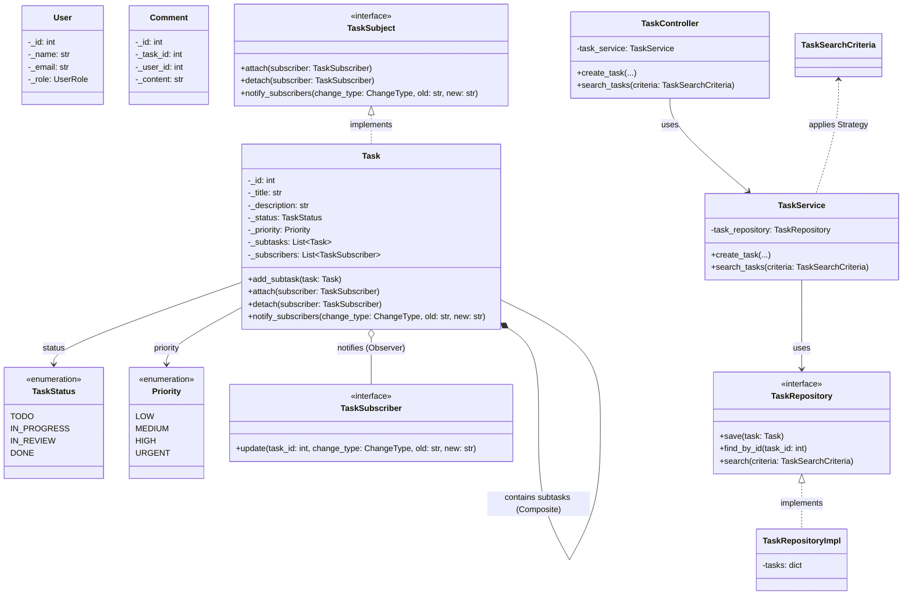

# Task Management System (Low-Level Design)

A comprehensive Python-based Low-Level Design (LLD) implementation of a **Task Management System**. This project demonstrates clean architecture, solid design principles, and several Gang of Four (GoF) design patterns commonly expected in system design interviews.

## 🏗 Architecture Layers

The system follows a standard Layered Architecture:
1. **Controller Layer:** Entry points for user actions (e.g., `TaskController`, `TaskAssignmentController`).
2. **Service Layer:** Core business logic and use cases (e.g., `TaskService`, `TaskNotificationService`).
3. **Repository Layer:** Data access abstraction using Abstract Base Classes (e.g., `TaskRepository`, `UserRepository`) with in-memory implementations (`TaskRepositoryImpl`).
4. **Domain Layer:** Business models, entities, and enums (`Task`, `User`, `TaskStatus`, `Priority`).

## 🎨 Design Patterns Utilized

- **Observer Pattern:** Used to notify users when a task they are subscribed to is updated (e.g., status changes, re-assignments). Defined in `domain/observer`.
- **Strategy Pattern:** Used for dynamic and interchangeable sorting and searching algorithms within `TaskSearchCriteria`.
- **State Pattern:** Governs the lifecycle and valid status transitions of a `Task` (TODO → IN_PROGRESS → DONE).
- **Composite Pattern:** Enables hierarchical task structuring where a `Task` can contain multiple sub-Tasks (`_subtasks`).

## 📊 UML Class Diagram



## 🚀 How to Run

Navigate to the project directory and execute the simulation script:

```bash
cd "TASK MANAGEMENT SYSTEM"
python3 main.py
```

The output will simulate different scenarios including task creation, user assignments, dynamic sorting, and real-time collaboration updates.
